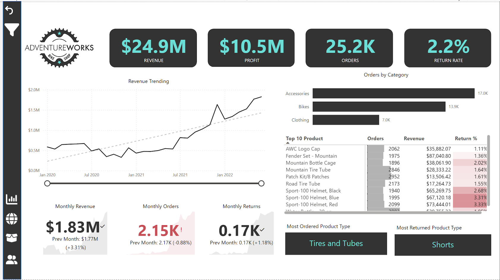
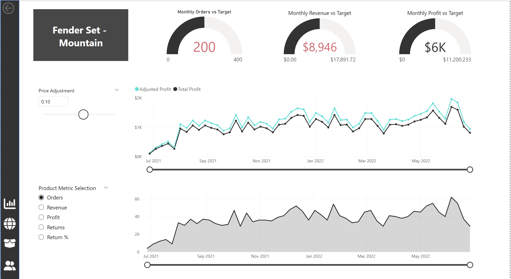
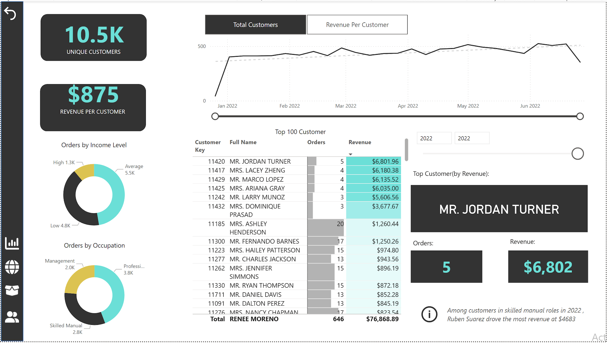
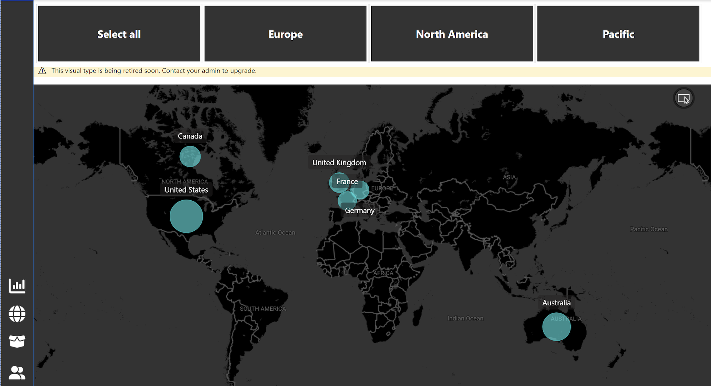

# 🏷️ AdventureWorks Executive Sales Dashboard  
**Tool:** Power BI | **Domain:** Retail & E-Commerce Analytics | **Type:** Business Intelligence Dashboard  

---

## 📘 Project Overview  

This project delivers an **interactive Power BI dashboard** built from the AdventureWorks dataset, designed to provide **executive-level insights** into revenue, profit, orders, and return trends across products, customers, and global markets.  

It showcases my ability to combine **data modeling, DAX, and visualization design** to produce an end-to-end business reporting solution that supports **data-driven decision-making**.  

---

## 🛠 Tools & Techniques Used
- **Power BI Desktop** – data modeling, DAX, and visualization
- **DAX** – calculated measures for revenue, profit, and What-If parameters
- **Excel / CSV** – data source formatting and cleaning
- **Data Modeling** – relationships between Sales, Products, and Geography tables
- **Design Thinking** – business storytelling and executive-friendly visuals

## 🎯 Objectives  

- Track monthly revenue, profit, and return rates.  
- Identify **top-performing products** and categories.  
- Analyze **customer behavior** by income level and occupation.  
- Visualize **geographic sales performance** across regions.  
- Simulate **pricing impacts** using What-If parameters.  

---
## 📈 Key Insights
- 🚲 **Bikes** generated the highest revenue (~$24.9M) with strong profit margins.
- 🌍 **Europe** outperformed other regions in both order volume and customer retention.
- 👥 **High-income professionals** had the highest average revenue per customer.
- 🧾 **Return rates** were lowest for accessories (≈1.5%), indicating quality satisfaction.
- 💡 **What-If analysis** showed that a 10% price increase yields a ~6% profit gain.

## 📊 Dashboard Pages 
---

## 📊 Dashboard Previews

<details>
  <summary>Click to view dashboard screenshots</summary>

  <h3>🧭 Executive Overview</h3>
  <p align="center">
    
  </p>

  <h3>🧩 Product Insights</h3>
  <p align="center">
    
  </p>

  <h3>👥 Customer Detail</h3>
  <p align="center">
    
  </p>

  <h3>🌍 Global Sales Map</h3>
  <p align="center">
    
  </p>

</details>

### **Page 1 – Executive Overview**  
- High-level KPIs: Revenue ($24.9 M), Profit ($10.5 M), Orders (25.2 K), Return Rate (2.2 %)  
- Revenue trending (2020 – 2022)  
- Top 10 products by revenue & return rate  
- Month-over-Month revenue & orders comparison  
- Most ordered vs most returned product types  

### **Page 2 – Customer Details**  
- 10.5 K unique customers, $875 avg revenue per customer  
- Segmentation by income level and occupation  
- Top customers by revenue & orders  
- Highlights of key segments (e.g., Skilled Manual roles and High-Income groups)  

### **Page 3 – Global Sales Map**  
- Regional sales distribution (America, Europe, Pacific)  
- Interactive region buttons with drill-through capability  

### **Page 4 – Product Insights**  
- KPI cards for monthly orders, revenue, and profit vs targets  
- Trend analysis of adjusted price and profit after price change  
- What-If parameter slider for price adjustment simulation  

---

## 🧠 DAX Highlights  
<details>
<summary>📊 Click to expand key DAX measures</summary>

```DAX
-- Revenue, Cost & Profit
Total_Revenue =
SUMX('Sales Data', 'Sales Data'[OrderQty] * 'Sales Data'[UnitPrice])

Total_Cost =
SUMX('Sales Data', 'Sales Data'[OrderQty] * 'Sales Data'[UnitCost])

Total_Profit =
[Total_Revenue] - [Total_Cost]


-- Orders & Returns
Total_Orders =
COUNTROWS('Sales Data')

Total_Returns =
COUNTROWS('Returns Data')

Return_Rate =
DIVIDE([Total_Returns], [Total_Orders])


-- Month-over-Month comparison
Prev_Month_Revenue =
CALCULATE([Total_Revenue],
    PREVIOUSMONTH('Calendar Lookup'[Date])
)

Revenue_MoM_% =
DIVIDE([Total_Revenue] - [Prev_Month_Revenue],
       [Prev_Month_Revenue])


-- Average_Retail_Price = AVERAGE ( 'Sales Data'[UnitPrice] )

-- What-If parameter table/measure created by Power BI:
-- 'Price Adjustment'[Adjustment Value]  -- e.g., 0.10 for +10%

Adjusted_Price =
[Average_Retail_Price] * ( 1 + 'Price Adjustment'[Adjustment Value] )

Adjusted_Revenue =
SUMX ( 'Sales Data', 'Sales Data'[OrderQty] * [Adjusted_Price] )

Adjusted_Profit = [Adjusted_Revenue] - [Total_Cost]

-- Category-Specific Insights
Bike_Returns =
CALCULATE([Total_Returns],
    'Product Categories'[Category] = "Bikes"
)

Bike_Return_Rate =
DIVIDE([Bike_Returns], [Total_Orders])
</details>

<details>
<summary>🗂️ Click to expand</summary>

AdventureWorks-Sales-Dashboard/
├── AdventureWorks-Sales.pbix          # Power BI file
├── Page1_Exec.png                     # Executive Overview screenshot
├── Page2_Customer.png                 # Customer Detail screenshot
├── Page3_Map.png                      # Global Sales Map screenshot
├── Page4_Product.png                  # Product Insights screenshot
├── README.md
├── LICENSE
└── .gitignore

</details>

## 🧭 How to Open the Dashboard

To explore this Power BI report:

1. Download the file: [`AdventureWorks-Sales.pbix`](./AdventureWorks-Sales.pbix)
2. Open it in **Microsoft Power BI Desktop**
3. Navigate between pages using the bottom tabs:
   - **Executive Overview**
   - **Customer Details**
   - **Global Sales Map**
   - **Product Insights**

🌿 Key Takeaway

A real-world business-intelligence solution demonstrating the integration of
data modeling, DAX analytics, and executive storytelling in Power BI
to generate actionable insights for retail and e-commerce operations.

⸻

👤 Author

Meshack Oniera
💼 Data Analyst | Power BI | SQL | Excel | Python

🔗 LinkedIn Profile
📧 kenomeshack@gmail.com
